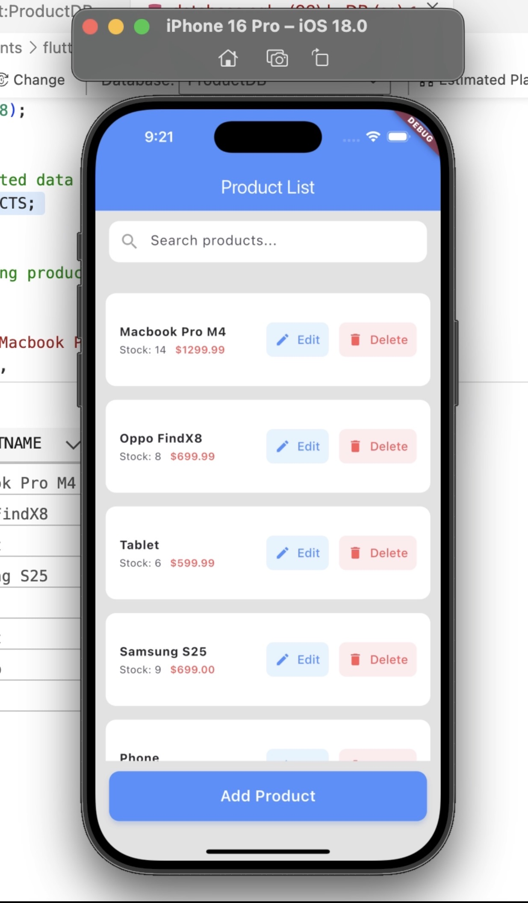
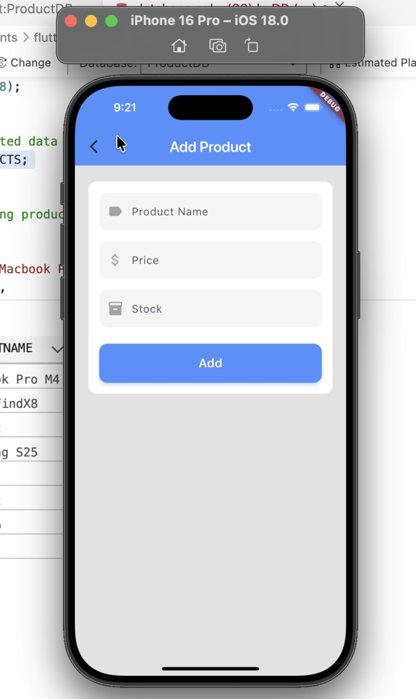
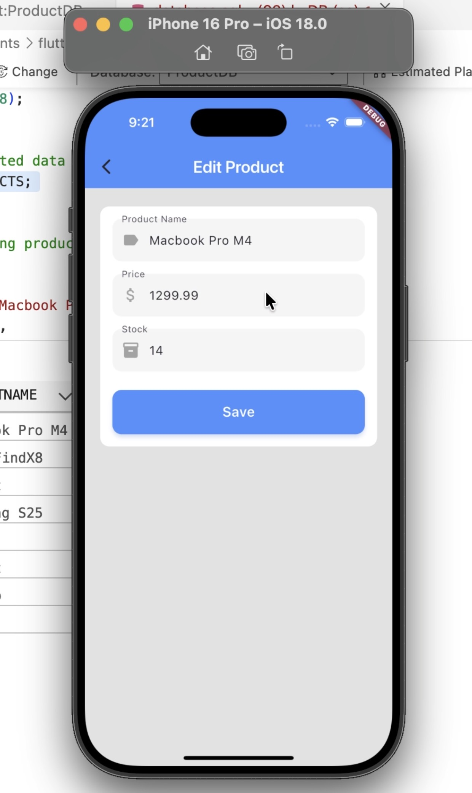
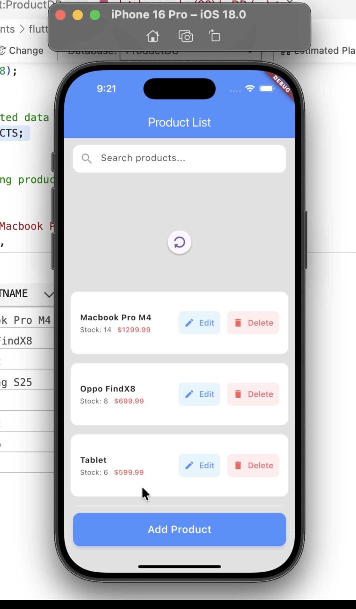
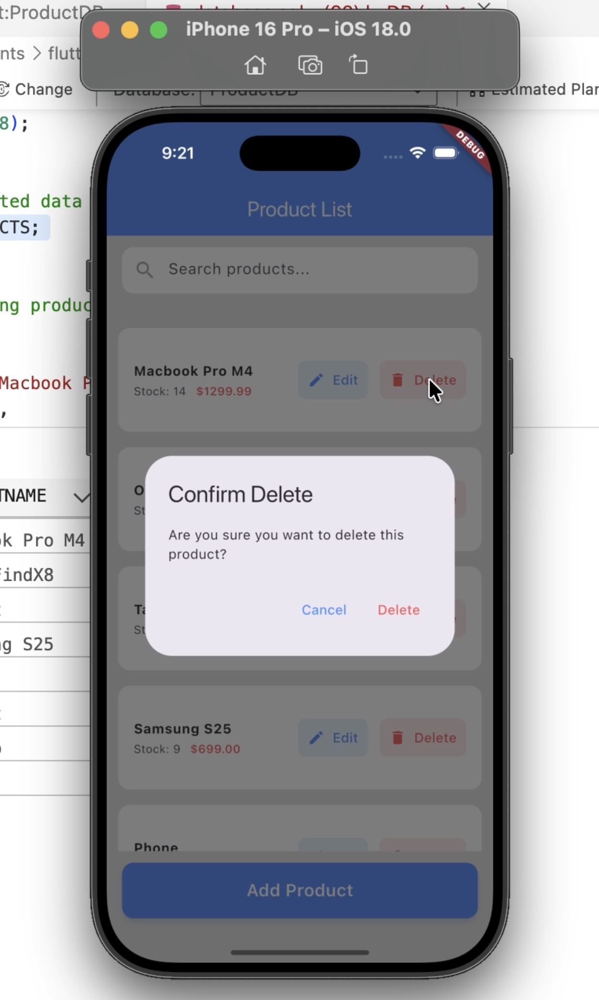
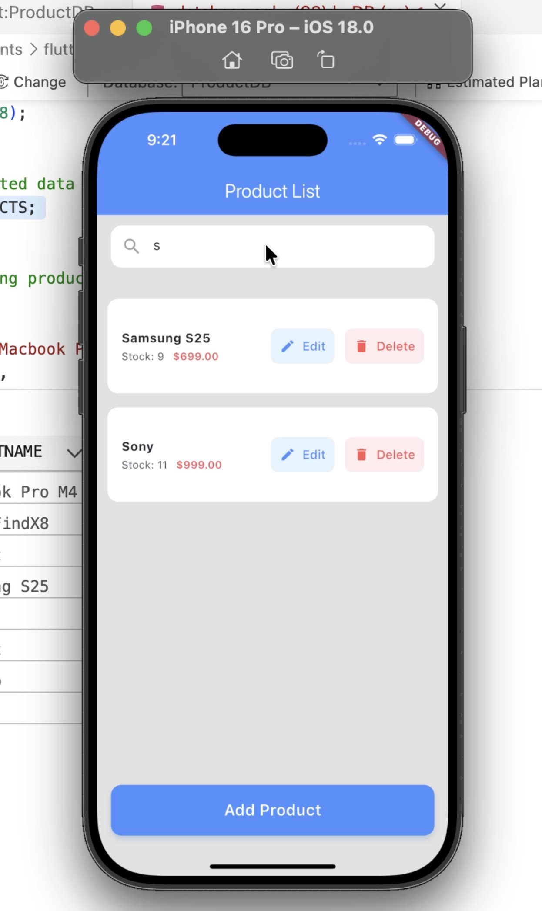

# flutter-express-crud
# Product CRUD App

A full-stack CRUD application for managing products using Flutter, Provider, Express.js, and SQL Server.

## Setup & Run Instructions

### Backend
1. Navigate to the `/backend` folder: `cd backend`
2. Install dependencies: `npm install`
3. Create a `.env` file by copying `.env.example` and fill in your SQL Server credentials.
4. Start the server: `node index.js`
    - The API will run on `http://localhost:3000`

### Frontend
1. Navigate to the `/frontend` folder: `cd frontend`
2. Install dependencies: `flutter pub get`
3. Configure the API base URL in the Flutter app (e.g., `http://localhost:3000`).
4. Run the app: `flutter run`

## API Base URL
- `http://localhost:3000/products`

## Features Implemented
- List all products
- Add new product
- Edit a product
- Delete with confirmation
- Pull-to-refresh
- Field validation
- RESTful API with JSON responses
- .env configuration for database credentials
- CORS enabled for Flutter to connect to backend

## Screenshots

### Product List Page

### Add Product Page

### Edit Product Page

### Pull Down Refresh

### Delete Confirmation

### Search Product

   
